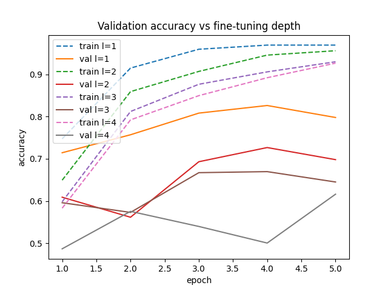

# transfer-learning

A transfer learning project using various extensions.

## Project Structure 

### Root Directory

- /data: dataset files
- /src: Python scripts and modules.
- README.md: Providing an overview and documentation.

## Quick Start
1. Clone the repo and navigate into it:
```bash
git clone git@github.com:johnpeterleo/transfer-learning.git
cd transfer-learning
```

### Install Requirements
```bash
pip install -r requirements.txt
```

### How To Run 

1. Run extract.py

Parses image filenames and builds a pandas DataFrame with metadata (breed, label, file path, image index).
```bash
cd src
python extract.py
```

2. Run beginning.py 
        
Binary transfer learning experiment (Cat vs Dog classification) using the built in dataset from torchvision.datasets.OxfordIIITPet provided by torch, and not extract.py (which can be used for training on imbalanced data). This part uses Adam optimizer with 0.001 learning rate. The old final layer is replaced with "model.fc = nn.Linear(model.fc.in_features, 2)" which means that instead of ResNets 1000 or so outputs, we instead have two for Cat and Dog. Then the replaced final layer is fine-tuned with pet datasets training data.
```bash
cd src
python beginning.py
```
      
Produces these results during training:
```bash
Epoch 0/4
--------------------
train loss: 0.2561 acc: 0.9049
val loss: 0.0999 acc: 0.9747

Epoch 1/4
--------------------
train loss: 0.0794 acc: 0.9804
val loss: 0.0630 acc: 0.9847

Epoch 2/4
--------------------
train loss: 0.0701 acc: 0.9791
val loss: 0.0500 acc: 0.9877

Epoch 3/4
--------------------
train loss: 0.0482 acc: 0.9867
val loss: 0.0435 acc: 0.9880

Epoch 4/4
--------------------
train loss: 0.0519 acc: 0.9823
val loss: 0.0392 acc: 0.9872

Training done in 5m 50s
Best val acc: 0.9880
```

3. Run multi_class.py 
        
Multi-class transfer learning experiment for all 37 pet breeds using the built in dataset from torchvision.datasets.OxfordIIITPet provided by torch, and not extract.py (which can be used for training on imbalanced data). This part uses Adam optimizer with 0.001 learning rate. The replaced final layer (37 output instead of resnets own 1000 or so outputs) is fine-tuned with pet datasets training data.
```bash
cd src
python multi_class.py
```
        
Produces these results during training:
```bash
Epoch 0/4
--------------------
train loss: 1.8515 acc: 0.5870
val loss: 0.8111 acc: 0.8362

Epoch 1/4
--------------------
train loss: 0.6194 acc: 0.8728
val loss: 0.5301 acc: 0.8681

Epoch 2/4
--------------------
train loss: 0.4177 acc: 0.9084
val loss: 0.4757 acc: 0.8654

Epoch 3/4
--------------------
train loss: 0.3382 acc: 0.9209
val loss: 0.4193 acc: 0.8757

Epoch 4/4
--------------------
train loss: 0.2888 acc: 0.9291
val loss: 0.3824 acc: 0.8828

Training done in 5m 54s
Best val acc: 0.8828
```

4. Run fine_tune_l_layers.py 
        
Multi-class transfer learning experiment for all 37 pet breeds using the built in dataset from torchvision.datasets.OxfordIIITPet provided by torch, and not extract.py (which can be used for training on imbalanced data). This part uses Adam optimizer with 0.001 learning rate. The replaced final layer (37 output instead of resnets own 1000 or so outputs) is fine-tuned with pet datasets training data. The major difference between this experiment and the previous one, i.e. multi_class.py, is that this code also trains the lower levels in iterations (not only the final fully-connected classification layer) for 4 different models in total such that we can compare the final accuracy.
```bash
cd src
python fine_tune_l_layers.py 
```

Produces these results during training:
```bash
Training with l = 1
Trainable parts: ['fc', 'layer4']
Trainable parameters: 13133349

Epoch 0/4
--------------------
train loss: 0.8745 acc: 0.7473
val loss: 0.9980 acc: 0.7144

Epoch 1/4
--------------------
train loss: 0.2754 acc: 0.9147
val loss: 0.8192 acc: 0.7569

Epoch 2/4
--------------------
train loss: 0.1416 acc: 0.9592
val loss: 0.6766 acc: 0.8081

Epoch 3/4
--------------------
train loss: 0.0966 acc: 0.9690
val loss: 0.6365 acc: 0.8261

Epoch 4/4
--------------------
train loss: 0.1111 acc: 0.9690
val loss: 0.7804 acc: 0.7978

Training done in 6m 18s
Best val acc: 0.8261

Training with l = 2
Trainable parts: ['fc', 'layer4', 'layer3']
Trainable parameters: 19955749

Epoch 0/4
--------------------
train loss: 1.1833 acc: 0.6495
val loss: 1.3146 acc: 0.6092

Epoch 1/4
--------------------
train loss: 0.4512 acc: 0.8590
val loss: 1.6595 acc: 0.5617

Epoch 2/4
--------------------
train loss: 0.3061 acc: 0.9068
val loss: 1.1015 acc: 0.6931

Epoch 3/4
--------------------
train loss: 0.1716 acc: 0.9454
val loss: 1.0452 acc: 0.7266

Epoch 4/4
--------------------
train loss: 0.1477 acc: 0.9557
val loss: 1.2527 acc: 0.6980

Training done in 8m 12s
Best val acc: 0.7266

Training with l = 3
Trainable parts: ['fc', 'layer4', 'layer3', 'layer2']
Trainable parameters: 21072165

Epoch 0/4
--------------------
train loss: 1.3381 acc: 0.5984
val loss: 1.3046 acc: 0.5961

Epoch 1/4
--------------------
train loss: 0.5856 acc: 0.8120
val loss: 1.4743 acc: 0.5732

Epoch 2/4
--------------------
train loss: 0.3915 acc: 0.8764
val loss: 1.2016 acc: 0.6672

Epoch 3/4
--------------------
train loss: 0.2948 acc: 0.9057
val loss: 1.1346 acc: 0.6697

Epoch 4/4
--------------------
train loss: 0.2234 acc: 0.9296
val loss: 1.5412 acc: 0.6451

Training done in 9m 12s
Best val acc: 0.6697

Training with l = 4
Trainable parts: ['fc', 'layer4', 'layer3', 'layer2', 'layer1']
Trainable parameters: 21294117

Epoch 0/4
--------------------
train loss: 1.3870 acc: 0.5832
val loss: 1.7479 acc: 0.4871

Epoch 1/4
--------------------
train loss: 0.6651 acc: 0.7921
val loss: 1.5463 acc: 0.5756

Epoch 2/4
--------------------
train loss: 0.4675 acc: 0.8495
val loss: 1.7293 acc: 0.5399

Epoch 3/4
--------------------
train loss: 0.3366 acc: 0.8918
val loss: 1.9219 acc: 0.5007

Epoch 4/4
--------------------
train loss: 0.2416 acc: 0.9264
val loss: 1.4866 acc: 0.6162

Training done in 10m 1s
Best val acc: 0.6162
```

And this graph for validation and training accuracy accross the models:


## Contact
John Christensen - johnchristensen@outlook.com


Lidya Nasser -   


August Filannino -       


Samy Zouggari - 