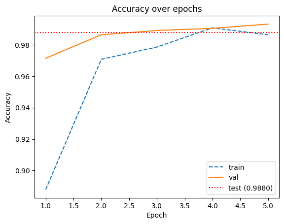
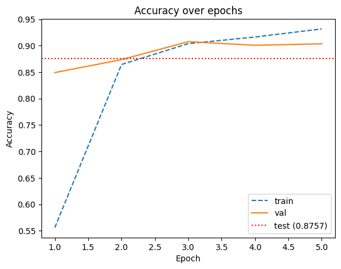

# transfer-learning

A transfer learning project using various extensions.

## Project Structure 

### Root Directory

- /data: dataset files
- /src: Python scripts and modules.
- README.md: Providing an overview and documentation.

## Quick Start
1. Clone the repo and navigate into it:
```bash
git clone git@github.com:johnpeterleo/transfer-learning.git
cd transfer-learning
```

### Install Requirements
```bash
pip install -r requirements.txt
```

### How To Run 

1. Run extract.py

Parses image filenames and builds a pandas DataFrame with metadata (breed, label, file path, image index).
```bash
cd src
python extract.py
```

2. Run beginning.py 
        
Binary transfer learning experiment (Cat vs Dog classification) using the built in dataset from torchvision.datasets.OxfordIIITPet provided by torch, and not extract.py (which can be used for training on imbalanced data). This part uses Adam optimizer with 0.001 learning rate. The old final layer is replaced with "model.fc = nn.Linear(model.fc.in_features, 2)" which means that instead of ResNets 1000 or so outputs, we instead have two for Cat and Dog. Then the replaced final layer is fine-tuned with pet datasets training data.
```bash
cd src
python beginning.py
```
      
Produces these results during training:
```bash
Epoch 0/4
--------------------
train loss: 0.2973 acc: 0.8879
val loss: 0.1014 acc: 0.9715

Epoch 1/4
--------------------
train loss: 0.1037 acc: 0.9708
val loss: 0.0682 acc: 0.9864

Epoch 2/4
--------------------
train loss: 0.0668 acc: 0.9786
val loss: 0.0462 acc: 0.9891

Epoch 3/4
--------------------
train loss: 0.0467 acc: 0.9908
val loss: 0.0385 acc: 0.9905

Epoch 4/4
--------------------
train loss: 0.0446 acc: 0.9864
val loss: 0.0352 acc: 0.9932

Training done in 2m 14s
Best val acc: 0.9932
Test accuracy: 0.9880
```

Producing this test accuracy:
```bash
Test accuracy: 0.9880
```

And this graph for validation and training accuracy:


3. Run multi_class.py 
        
Multi-class transfer learning experiment for all 37 pet breeds using the built in dataset from torchvision.datasets.OxfordIIITPet provided by torch, and not extract.py (which can be used for training on imbalanced data). This part uses Adam optimizer with 0.001 learning rate. The replaced final layer (37 output instead of resnets own 1000 or so outputs) is fine-tuned with pet datasets training data.
```bash
cd src
python multi_class.py
```
        
Produces these results during training:
```bash
Epoch 0/4
--------------------
train loss: 2.0081 acc: 0.5560
val loss: 0.8989 acc: 0.8492

Epoch 1/4
--------------------
train loss: 0.7100 acc: 0.8645
val loss: 0.5493 acc: 0.8736

Epoch 2/4
--------------------
train loss: 0.4696 acc: 0.9039
val loss: 0.4106 acc: 0.9076

Epoch 3/4
--------------------
train loss: 0.3741 acc: 0.9164
val loss: 0.3644 acc: 0.9008

Epoch 4/4
--------------------
train loss: 0.3072 acc: 0.9317
val loss: 0.3434 acc: 0.9035

Training done in 2m 14s
Best val acc: 0.9076
Test accuracy: 0.8757
```

Producing this test accuracy:
```bash
Test accuracy: 0.8757
```

And this graph for validation and training accuracy:


4. Run fine_tune_l_layers.py 
        
Multi-class transfer learning experiment for all 37 pet breeds using the built in dataset from torchvision.datasets.OxfordIIITPet provided by torch, and not extract.py (which can be used for training on imbalanced data). This part uses Adam optimizer with 0.001 learning rate. The replaced final layer (37 output instead of resnets own 1000 or so outputs) is fine-tuned with pet datasets training data. The major difference between this experiment and the previous one, i.e. multi_class.py, is that this code also trains the lower levels in iterations (not only the final fully-connected classification layer) for 4 different models in total such that we can compare the final accuracy.
```bash
cd src
python fine_tune_l_layers.py 
```

Produces these results during training:
```bash
Trainable parts: ['fc', 'layer4']
Trainable parameters: 13133349

Epoch 0/4
--------------------
train loss: 0.9358 acc: 0.7334
val loss: 0.7538 acc: 0.7826

Epoch 1/4
--------------------
train loss: 0.2507 acc: 0.9212
val loss: 0.7287 acc: 0.7853

Epoch 2/4
--------------------
train loss: 0.1412 acc: 0.9596
val loss: 0.7286 acc: 0.8016

Epoch 3/4
--------------------
train loss: 0.0786 acc: 0.9786
val loss: 0.4992 acc: 0.8587

Epoch 4/4
--------------------
train loss: 0.0665 acc: 0.9810
val loss: 0.5942 acc: 0.8370

Training done in 2m 7s
Best val acc: 0.8587
Evaluating best model for l=1 on test set...
  Test accuracy: 0.8277

Training with l = 2
Trainable parts: ['fc', 'layer4', 'layer3']
Trainable parameters: 19955749

Epoch 0/4
--------------------
train loss: 1.2063 acc: 0.6444
val loss: 1.8151 acc: 0.4959

Epoch 1/4
--------------------
train loss: 0.4612 acc: 0.8590
val loss: 1.0145 acc: 0.7052

Epoch 2/4
--------------------
train loss: 0.3160 acc: 0.9018
val loss: 1.0021 acc: 0.7024

Epoch 3/4
--------------------
train loss: 0.2067 acc: 0.9412
val loss: 1.0504 acc: 0.6997

Epoch 4/4
--------------------
train loss: 0.1065 acc: 0.9691
val loss: 1.0505 acc: 0.7242

Training done in 2m 19s
Best val acc: 0.7242
Evaluating best model for l=2 on test set...
  Test accuracy: 0.6934

Training with l = 3
Trainable parts: ['fc', 'layer4', 'layer3', 'layer2']
Trainable parameters: 21072165

Epoch 0/4
--------------------
train loss: 1.4335 acc: 0.5873
val loss: 1.5097 acc: 0.5530

Epoch 1/4
--------------------
train loss: 0.6274 acc: 0.8101
val loss: 2.0108 acc: 0.4660

Epoch 2/4
--------------------
train loss: 0.3776 acc: 0.8791
val loss: 1.1370 acc: 0.6658

Epoch 3/4
--------------------
train loss: 0.2580 acc: 0.9185
val loss: 1.4492 acc: 0.6277

Epoch 4/4
--------------------
train loss: 0.1412 acc: 0.9589
val loss: 1.2788 acc: 0.6495

Training done in 2m 29s
Best val acc: 0.6658
Evaluating best model for l=3 on test set...
  Test accuracy: 0.6803

Training with l = 4
Trainable parts: ['fc', 'layer4', 'layer3', 'layer2', 'layer1']
Trainable parameters: 21294117

Epoch 0/4
--------------------
train loss: 1.4545 acc: 0.5785
val loss: 2.6749 acc: 0.4198

Epoch 1/4
--------------------
train loss: 0.6966 acc: 0.7806
val loss: 1.8417 acc: 0.5095

Epoch 2/4
--------------------
train loss: 0.4534 acc: 0.8553
val loss: 3.3504 acc: 0.3655

Epoch 3/4
--------------------
train loss: 0.3624 acc: 0.8828
val loss: 1.9145 acc: 0.5598

Epoch 4/4
--------------------
train loss: 0.2226 acc: 0.9293
val loss: 1.2174 acc: 0.6712

Training done in 2m 42s
Best val acc: 0.6712
Evaluating best model for l=4 on test set...
  Test accuracy: 0.6225
```

Producing these test accuracies:
```bash
l = 1: Test accuracy: 0.8277
l = 2: Test accuracy: 0.6934
l = 3: Test accuracy: 0.6803
l = 4: Test accuracy: 0.6225
```


And this graph for validation and training accuracy accross the models:


## Contact
John Christensen - johnchristensen@outlook.com


Lidya Nasser -   


August Filannino -       


Samy Zouggari - 